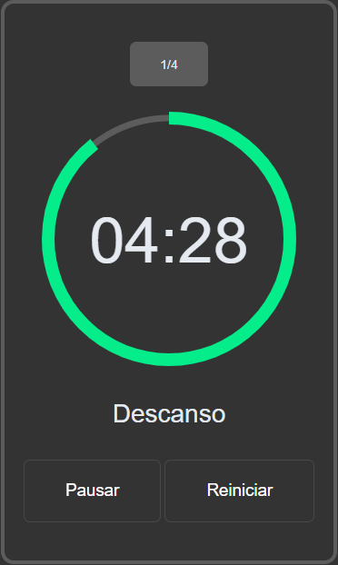

<h1>⏰ Pomodoro</h1>

 

> <h2>📚 About </h2>

 

 Another small project in my saga training programming logic. 
    This time I made a very simple pomodoro with the main objective of testing an "animation" technique with SVG.

 
  

> <h2>🔍 I used it here </h2>

 

<ul>
  <li>JavaScript</li>
  <li>Css</li>
  <li>Html</li>
</ul>

 
 

