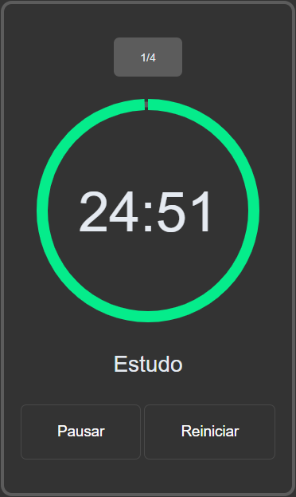

<h1>⏰ Pomodoro</h1>

 

> <h2>📚 About </h2>

 

 Another small project in my saga training programming logic. 
    This time I made a very simple pomodoro with the main objective of testing an "animation" technique with SVG.

 
  

> <h2>🔍 I used it here </h2>

 

<ul>
  <li>JavaScript</li>
  <li>Css</li>
  <li>Html</li>
</ul>

 

> ## ❤️ Lastly

 
This is the second repository belonging to a "series" with the purpose of practicing programming logic. If you want to check the other repositories belonging to this "series": 

<ul>
<li><a href='https://github.com/JoaoMarcelo-J/tictactoe-game'>Tic Tac Toe</a></li>
<li><a href='https://github.com/JoaoMarcelo-J/memory-game'>Memory Game</a></li>
</ul>

 

